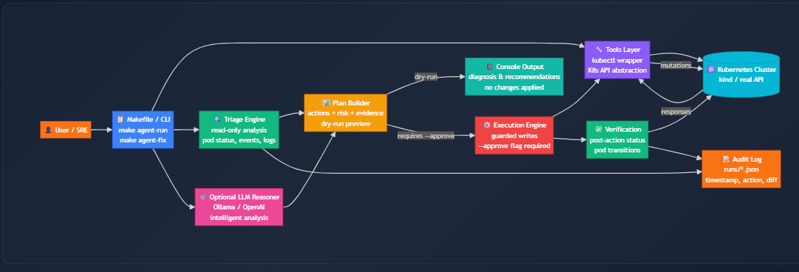

# Kubernetes Incident Triage & Remediation Agent (Local, OSS)

A local, open-source **agentic system** for detecting Kubernetes incidents, performing safe triage, and executing **guard-railed remediation** with full auditability.

The system is designed to operate against **real Kubernetes clusters**, prioritizing **correctness, safety, and explainability** over blind automation.

This project is not about flashy autonomy. It is about **trustworthy operations**.

---

## Why this exists

In production Kubernetes environments:

- failures are inevitable
- incorrect automation increases blast radius
- every change must be explainable, reviewable, and traceable

Most “AI agents” ignore these realities.

This project demonstrates a **responsible approach to agentic infrastructure systems**, where diagnosis, decision-making, and execution are deliberately separated.

The agent follows a strict operational loop:

**observe → reason → propose → approve → act → verify → record**

- No cloud dependency. 
- No hidden automation. 
- No speculative execution.

---

## Core design principles

- **Real Kubernetes behavior** (kind cluster, real control plane semantics)
- **Read-only by default** (diagnosis is non-destructive)
- **Explicit approval for all write operations**
- **Separation of reasoning and execution**
- **Evidence-first decisions** (no evidence → no action)
- **Immutable audit trail**

These constraints are intentional and foundational.

---

## Modes of operation

## Deterministic local agent (default)

- Rule-based triage using Kubernetes signals
- Fast, predictable, and safe
- Suitable for operational environments

```
make agent-run
```

## LLM-assisted agent (optional)

- Uses a local LLM via Ollama
- Improves diagnosis, classification, and action ranking
- Never executes writes without policy enforcement and explicit approval

```
make llm-run
```
Approved execution:
```
make llm-run-approve
```
The LLM is a reasoning assistant, not an operator.


## LLM integration (Ollama)

- Provider: Ollama (local)
- Models tested: qwen2.5:7b, llama3.1:8b
- Role: summarize evidence, classify incidents, rank remediation options

### Guardrails

- LLM receives only evidence bundles (pods, events, logs)
- All write actions are policy-checked
- --approve is mandatory for mutations
- No speculative execution

### Preflight check:
```
curl http://localhost:11434/api/tags
```
---
## System architecture (operator model)

The system follows an operator-style architecture, running outside the Kubernetes cluster and interacting through a controlled tooling layer.

All cluster mutations are explicitly gated, policy-validated, and auditable. The optional LLM component participates only in reasoning and never executes actions directly.



*High-level architecture showing separation of triage, planning, execution, and verification.*

The agent runs outside the cluster and interacts with Kubernetes through a controlled `kubectl` abstraction.


---

## Agent workflow

The agent operates in clearly separated phases to ensure that discovery, decision-making, and execution are never conflated.

Human approval is mandatory for all state-changing operations, and verification is performed after every approved action.

A detailed end-to-end workflow, including policy validation and audit logging, is documented in:

- [docs/workflow.md](docs/workflow.md)

---

## Evidence-first reasoning

Health is determined using:

- `containerStatuses[].state.waiting.reason`
- restart counts
- last termination exit codes
- scheduling and runtime events
- current and previous logs

---

## Repository structure
```
k8s-incident-agent/
├── local/
│   └── agent/
│       ├── main.py          # Read-only triage
│       ├── remediate.py     # Guarded remediation
│       └── tools/
│           └── kubectl.py
├── llm_agent/
│   └── agent/
│       └── cli.py           # LLM-assisted reasoning
├── local/scenarios/
│   └── crashloop/
│       └── manifest.yaml
├── local/manifests/
│   └── demo-app.yaml
├── docs/
│   ├── architecture.png
│   └── workflow.md
├── runs/
│   └── remediate-*.json     # Immutable audit records
├── Makefile
└── README.md
```
---
## Quick start
```
make cluster-create
make demo-app
make scenario-crashloop
make agent-run
```
---
## Remediation (guarded)

Dry-run (no changes applied):
```
make agent-fix-crashy
```
Approved execution:
```
make agent-fix-crashy-approve
```
Verification:
```
make agent-run
```
---
## Safety & controls

- Read-only by default
- Namespace-scoped execution
- Explicit allowlist of actions
- Approval required for all mutations
- High-risk actions blocked by policy
- Full audit trail for every change

---
## Audit trail

Every approved remediation produces a structured JSON record:
```
{
  "timestamp": "2026-01-02T03:15:19Z",
  "namespace": "demo",
  "action": "patch_command",
  "target": "deploy/crashy",
  "approved": true,
  "result": "success"
}
```
Audit logs enable traceability, accountability, and post-incident analysis.
---
## Non-goals

- Fully autonomous remediation
- Black-box execution
- Unbounded or speculative automation

Correctness, safety, and explainability take precedence.
---
## Future extensions

- Additional failure modes (ImagePullBackOff, OOMKilled, Pending)
- Risk scoring and blast-radius estimation
- In-cluster execution with RBAC
- Metrics-based signal correlation
- Structured post-incident reports

---
This project intentionally favors restraint.

That is what makes it production-appropriate.


