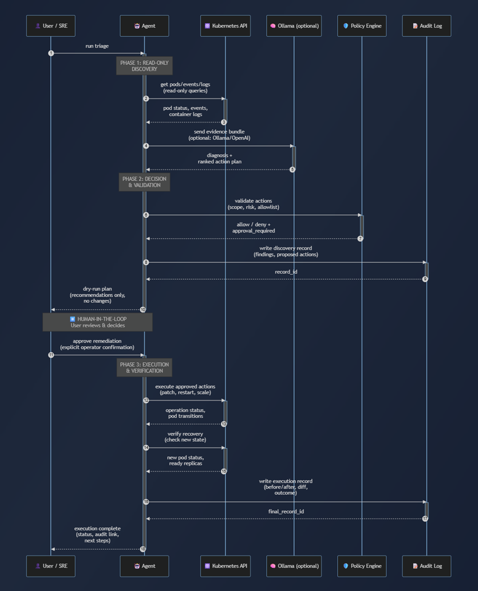

# Agent Workflow

This document describes the end-to-end operational workflow of the Kubernetes Incident Triage & Remediation Agent.

The workflow is intentionally divided into three phases:

- **Phase 1: Read-only discovery**
- **Phase 2: Decision and validation**
- **Phase 3: Execution and verification**

The sequence below illustrates how the agent interacts with the Kubernetes API, optional LLM reasoning, policy engine, and audit log while enforcing human-in-the-loop controls.

